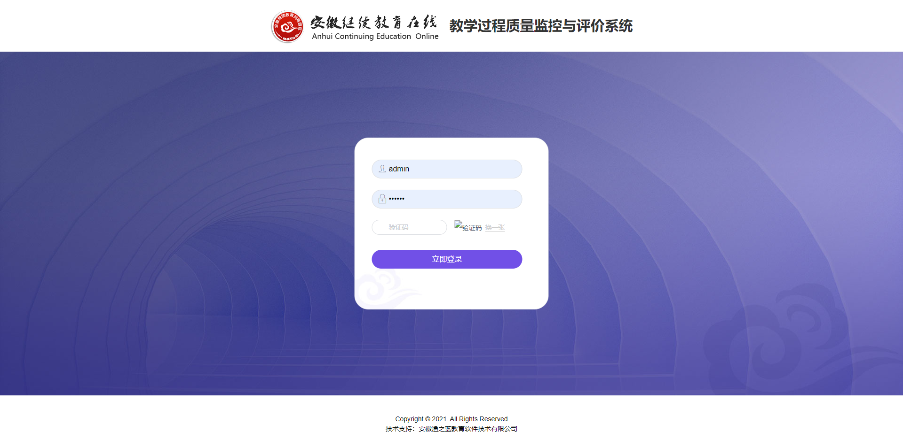
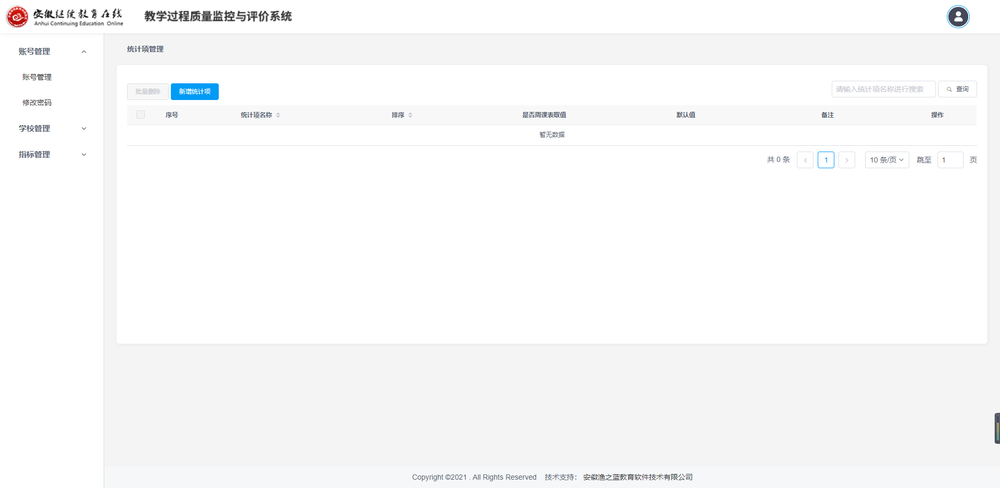
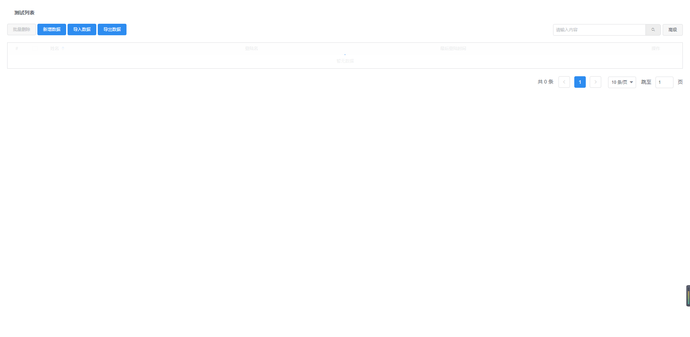

 
 
# zhijiao-cli
## 命令介绍
### 创建项目
输入项目命令后进行输入项目名称，选择项目模版，可选是否立即安装依赖，回车后即可
```
zhijiao create <project-name>
```

#### 模板选择
该项目提供两个项目框架使用：
intact 完整框架项目
##### 登录页

##### 主页面


inline 内嵌框架项目
##### 主页面


